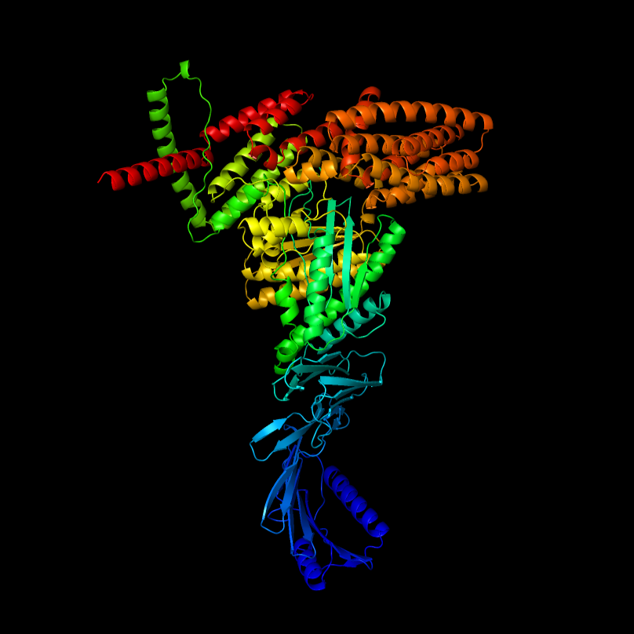

<!-- Improved compatibility of back to top link: See: https://github.com/othneildrew/Best-README-Template/pull/73 -->
<a name="readme-top"></a>
<!--
*** Thanks for checking out the Best-README-Template. If you have a suggestion
*** that would make this better, please fork the repo and create a pull request
*** or simply open an issue with the tag "enhancement".
*** Don't forget to give the project a star!
*** Thanks again! Now go create something AMAZING! :D
-->


<!-- PROJECT SHIELDS -->
<!--
*** I'm using markdown "reference style" links for readability.
*** Reference links are enclosed in brackets [ ] instead of parentheses ( ).
*** See the bottom of this document for the declaration of the reference variables
*** for contributors-url, forks-url, etc. This is an optional, concise syntax you may use.
*** https://www.markdownguide.org/basic-syntax/#reference-style-links
-->


<!-- PROJECT LOGO -->
<br />
<div align="center">
  <a href="https://github.com/naity/protein-transformer">
    
  </a>
 
<h3 align="center">Protein-Transformer</h3>

  <p align="center">
    Implement, train, tune, and evaluate a transformer model for antibody classification with this step-by-step code.
    <br />
    <br />
    <br />
    <a href="https://towardsdatascience.com/building-transformer-models-for-proteins-from-scratch-60884eab5cc8">Read on Medium </a>
    ·
    <a href="https://open.substack.com/pub/ytian/p/building-transformer-models-for-proteins?r=2mh9ns&utm_campaign=post&utm_medium=web&showWelcomeOnShare=true">Read on Substack</a>
    ·
    <a href="https://github.com/naity/protein-transformer/issues">Report Bug</a>
    ·
    <a href="https://github.com/naity/protein-transformer/issues">Request Feature</a>
  </p>
</div>


<!-- TABLE OF CONTENTS -->
<details>
  <summary>Table of Contents</summary>
  <ol>
    <li>
      <a href="#about-the-project">About The Project</a>
      <ul>
        <li><a href="#built-with">Built With</a></li>
      </ul>
    </li>
    <li>
      <a href="#getting-started">Getting Started</a>
      <ul>
        <li><a href="#prerequisites">Prerequisites</a></li>
      </ul>
    </li>
    <li><a href="#usage">Usage</a></li>
    <li><a href="#roadmap">Roadmap</a></li>
    <li><a href="#contributing">Contributing</a></li>
    <li><a href="#license">License</a></li>
    <li><a href="#contact">Contact</a></li>
    <li><a href="#acknowledgments">Acknowledgments</a></li>
  </ol>
</details>


<!-- ABOUT THE PROJECT -->
## About The Project

This project provides a step-by-step guide to implementing a transformer model for protein data, covering training, hyperparameter tuning, and evaluation. 

**Highlights**

* **Hands-on Transformer Implementation:** Follow along with code to build a transformer-based antibody classifier.
* **Optimize Performance:** Explore hyperparameter tuning techniques to improve the model's accuracy.
* **Evaluation:** Assess the model's generalization ability and gain insights into its performance on a hold-out test dataset.

<p align="right">(<a href="#readme-top">back to top</a>)</p>


### Built With

* [![Python][Python_badge]][Python-url]
* [![Pytorch][Pytorch_badge]][Pytorch-url]
* [![Ray][Ray_badge]][Ray-url]
* [![scikit-learn][scikit-learn_badge]][scikit-learn-url]
* [![Pandas][pandas_badge]][pandas-url]
* [![NumPy][numpy_badge]][numpy-url]
* [![Typer][typer_badge]][typer-url]

<p align="right">(<a href="#readme-top">back to top</a>)</p>


<!-- GETTING STARTED -->
## Getting Started

Clone the repo:
```sh
git clone https://github.com/naity/protein-transformer.git
```

### Prerequisites

The `requirements.txt` file lists the Python packages that need to be installed in order to run the scripts. Please use the command below for installation.
  ```sh
  pip install -r requirements.txt
  ```

<p align="right">(<a href="#readme-top">back to top</a>)</p>


<!-- USAGE EXAMPLES -->
## Usage
In this project, we will implement, train, optimize, and evaluate a transformer-based model for antibody classification. The data has been preprocessed, formatted as a binary classification problem with a balanced number of samples in each class. Processed datasets are stored in the `data/` directory: `bcr_train.parquet` is used for training and tuning, while `bcr_test.parquet` is the hold-out test dataset. For details on the preprocessing steps, please refer to the `notebooks/bcr_preprocessing.ipynb` notebook.

**1. Running the `train.py` Script**

See the table below for key parameters when running the `train.py` script. For a full list of options, run:

```sh
python protein_transformer/train.py --help 
```

| Parameter | Description | Default|
| -------- | ------- | ------- |
|--run-id | Unique name for the training run | None (Required)
|--dataset-loc | Path to the dataset in parquet format | None (Required)
|--val-size | Proportion of the dataset for validation | 0.15
|--embedding-dim | Dimensionality of token embeddings | 64
|--num-layers | Number of Transformer encoder layers | 8
|--num-heads | Number of attention heads in the encoder | 2
|--ffn-dim | Dimensionality of the feed-forward layer in the encoder | 128
|--dropout | Dropout probability for regularization | 0.05
|--batch-size | Number of samples per batch for each worker | 32
|--lr | The learning rate for the optimizer | 2e-5
|--num-epochs | Number of epochs for training | 20

For example, to execute the training script with default parameters and store the results under a run ID named `train01`, use the following command:

```sh
python protein_transformer/train.py --run-id train01 --dataset-loc data/bcr_train.parquet
``` 

Upon completion, the script stores training results in the `runs/train01` directory by default. This includes model arguments, the best-performing model (based on validation loss), training and validation loss records, along with validation metrics for each epoch. These metrics, which include the following, are saved in the `runs/train01/results.csv` file:

```
Accuracy: 0.727
AUC score: 0.851
Precision: 0.734
Recall: 0.727
F1-score: 0.725
```


**2. Running the `tune.py` Script**

See the table below for key parameters when running the `tune.py` script. For a full list of options, run:

```sh
python protein_transformer/tune.py --help 
```

| Parameter | Description | Default|
| -------- | ------- | ------- |
|--run-id | Unique name for the hyperparameter tuning run | None (Required)|
|--dataset-loc | Absolute path to the dataset in parquet format | None (Required)|
|--val-size | Proportion of the dataset for validation | 0.15|
|--num-classes | Number of final output dimensions | 2|
|--batch-size | Number of samples per batch for each worker | 32|
|--num-epochs | Number of epochs for training (per trial) | 30|
|--num-samples | Number of trials for tuning | 100|
|--gpu-per-trial | Number of GPUs to allocate per trial | 0.2|

* Note: The --dataset-loc parameter must be specified as an absolute path.

For example, to initiate the tuning process with default parameters and store the results under a run ID named `tune01`, execute the `tune.py` script from the project root directory:

```sh
python protein_transformer/tune.py --run-id tune01 --dataset-loc /home/ytian/github/protein-transformer/data/bcr_train.parquet
```

By default, it will execute 100 trials with different parameter combinations, running each trial for up to 30 epochs. Ray Tune utilizes early stopping for unpromising trials, allowing for efficient exploration of the hyperparameter space and focuses resources on better-performing configurations. It will track the results of each trial, and upon completion, the best-performing model based on validation loss will be saved in the `runs/tune01` directory by default. Additionally, tuning logs, including results from each trial, are stored within the same `runs/tune01` directory for easy access and analysis.


**3. Running the `evaluate.py` Script**

See the table below for key parameters when running the `evaluate.py` script. For a full list of options, run:

```sh
python protein_transformer/evaluate.py --help 
```
| Parameter | Description | Default|
| -------- | ------- | ------- |
|--run-dir | Path to the output directory for a training or tuning run | None (Required)|
|--dataset-loc | Path to the test dataset in parquet format | None (Required)|
|--batch-size | Number of samples per batch | 64|
  

For example, to evaluate the best model from the `tune01` run on the hold-out test dataset, execute the following command from the command line:

```sh
python protein_transformer/evaluate.py --run-dir runs/tune01 --dataset-loc /home/ytian/github/protein-transformer/data/bcr_test.parquet
```

Upon completion, the script will save test metrics in a file named `test_metrics.json`, like the following example, within the  run directory provided in the `evaluate.py` command:

```
Accuracy: 0.761
AUC score: 0.837
Precision: 0.761
Recall: 0.761
F1-score: 0.761
```

<p align="right">(<a href="#readme-top">back to top</a>)</p>


<!-- ROADMAP -->
## Roadmap

- [x] Data Processing
- [x] Model Implementation
- [x] Training
- [x] Hyperparameter Tuning
- [x] Evaluation

See the [open issues](https://github.com/naity/finetune-esm/issues) for a full list of proposed features (and known issues).

<p align="right">(<a href="#readme-top">back to top</a>)</p>


<!-- CONTRIBUTING -->
## Contributing

Contributions are what make the open source community such an amazing place to learn, inspire, and create. Any contributions you make are **greatly appreciated**.

If you have a suggestion that would make this better, please fork the repo and create a pull request. You can also simply open an issue with the tag "enhancement".
Don't forget to give the project a star! Thanks again!

1. Fork the Project
2. Create your Feature Branch (`git checkout -b feature/AmazingFeature`)
3. Commit your Changes (`git commit -m 'Add some AmazingFeature'`)
4. Push to the Branch (`git push origin feature/AmazingFeature`)
5. Open a Pull Request

<p align="right">(<a href="#readme-top">back to top</a>)</p>


<!-- LICENSE -->
## License

Distributed under the Apache License. See `LICENSE.txt` for more information.

<p align="right">(<a href="#readme-top">back to top</a>)</p>


<!-- CONTACT -->
## Contact

<p align="left">
<a href="https://linkedin.com/in/ytiancompbio" target="blank"></a>
<a href="https://twitter.com/ytiancompbio" target="blank"></a>
<a href="https://medium.com/@yuan_tian" target="blank"></a>
<a href="https://www.youtube.com/c/ytiancompbio" target="blank"></a>
</p>

<p align="right">(<a href="#readme-top">back to top</a>)</p>


<!-- ACKNOWLEDGMENTS -->
## Acknowledgments

* [IEDB](https://www.iedb.org/)
* [UvA Deep Learning](https://uvadlc-notebooks.readthedocs.io/en/latest/index.html)
* [Made With ML](https://madewithml.com/)

<p align="right">(<a href="#readme-top">back to top</a>)</p>


<!-- MARKDOWN LINKS & IMAGES -->
<!-- https://www.markdownguide.org/basic-syntax/#reference-style-links -->
[Python_badge]: https://img.shields.io/badge/Python-3776AB?logo=python&logoColor=fff&style=flat
[Python-url]: https://www.python.org/
[Pytorch_badge]: https://img.shields.io/badge/PyTorch-EE4C2C?logo=pytorch&logoColor=fff&style=flat
[Pytorch-url]: https://pytorch.org/
[Ray_badge]: https://img.shields.io/badge/Ray-028CF0?logo=ray&logoColor=fff&style=flat
[Ray-url]: https://www.ray.io/
[pandas_badge]: https://img.shields.io/badge/pandas-150458?logo=pandas&logoColor=fff&style=flat
[pandas-url]: https://pandas.pydata.org/
[numpy_badge]: https://img.shields.io/badge/NumPy-013243?logo=numpy&logoColor=fff&style=flat
[numpy-url]: https://numpy.org/
[scikit-learn_badge]: https://img.shields.io/badge/scikit--learn-F7931E?logo=scikitlearn&logoColor=fff&style=flat
[scikit-learn-url]: https://scikit-learn.org/stable/index.html
[typer_badge]: https://img.shields.io/badge/Typer-000?logo=typer&logoColor=fff&style=flat
[typer-url]: https://typer.tiangolo.com/
